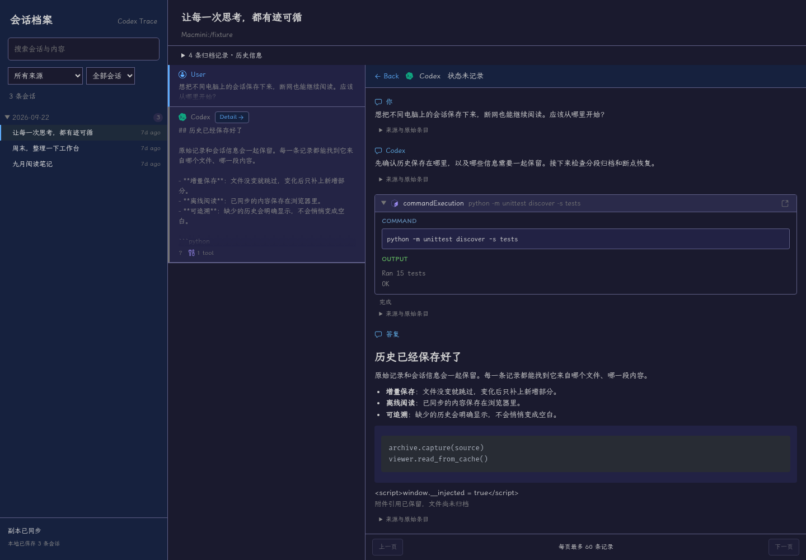
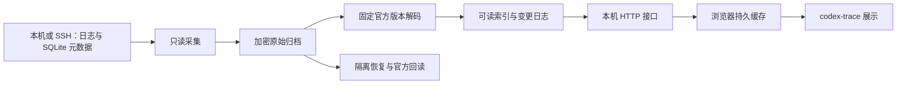

# Codex Session Replica

为在多台电脑使用 Codex 的个人用户保存会话档案：从本机或 SSH 来源增量采集原始历史，在独立归档中保留数据，通过浏览器阅读、搜索和离线补齐。原生 Codex 继续负责会话执行。

- **归档**：保留原始字节与元数据，区分不同来源、内容代次、当前历史头和父历史前缀。
- **阅读**：复用 codex-trace 的会话、轮次与工具详情组件；浏览器保存已同步内容。
- **恢复**：在支持的格式与运行时范围内，恢复到新建的隔离原生目录，并用官方接口回读核对。



截图由 `tests/viewer_fixture.py` 生成数据后实际运行浏览器取得；画面中的命令输出也是样本内容，可复跑检查见下方[验证入口](#验证)。

## 架构与边界



采集失败不会删除已有历史；缺失依赖和未能解码的部分明确标记。浏览器缓存使用 IndexedDB（浏览器内置数据库），页面资源使用 Service Worker（离线资源服务）缓存。原始对象加密保存，可读索引和浏览器副本包含明文。

服务端索引重建后若序号回退，需要手动重建浏览器副本，见[查看器说明](docs/Viewer-Usage.md#离线与重新连接)。

可取得的 owner（原生会话所属进程）通知可持久重放，但**不承诺完整逐字或终端直播**。不合并已有原生目录，不复制工作区、凭据及外部附件文件，也不宣称支持任意 Codex 版本。恢复范围见[恢复说明](docs/Restore-Usage.md)。

## 安装与演示

在仓库根目录运行。需要 Python 3.12+、Node.js 22、npm、zstd；官方适配器另外需要 Rust/rustup、GitHub CLI（`gh api` 需可用认证）和 C/C++ 构建工具。适配器固定版本与工具链见 [source.json](adapters/official/source.json)，初次构建需要下载源码及 Rust 依赖。

```sh
python3 -m venv .venv
. .venv/bin/activate
python -m pip install -r requirements.txt
npm --prefix viewer ci
npm --prefix viewer run build
python adapters/official/prepare.py --download
python scripts/demo.py --root /tmp/codex-replica-demo --port 8766
```

`--root` 必须是尚不存在的目录。打开 `http://127.0.0.1:8766`，选择“生成样本：跨设备会话归档”，点击 **Detail**，展开工具记录和“来源与原始条目”。演示会真正执行生成源数据→采集→原始字节导出核对→官方投影→浏览器阅读；只使用生成数据。终端 Ctrl+C 停止服务，演示目录保留。

先等待“副本已同步”，保持同一地址和浏览器，断网后重新加载即可检查离线阅读。自动验证包括浏览器重开与重连补齐，见[验证入口](#验证)。

## 使用自己的历史

用一条命令添加来源：

```sh
python3 scripts/add_source.py --server Macmini --ssh NewMachine --host NewMachine
```

前提是中心能够通过 SSH 登录新机器；目录探测、配置备份和生效方式见[接入说明](docs/Archive-Usage.md#一条命令接入新机器)。也可按归档说明手动配置来源，执行 `collect` 或 `watch`；按[查看器说明](docs/Viewer-Usage.md)执行 `normalize` 和 `serve`。持续采集、投影和查看服务分别运行，关闭查看器不停止采集。已有机器的快捷入口见[启动说明](docs/Launcher-Usage.md)。

- [归档格式](docs/Archive-Format.md)：完整扫描、原始提交边界与历史依赖。
- [查看器协议](docs/Viewer-Protocol.md)：快照、增量、游标与来源定位。
- [通知观察](docs/Owner-Observation.md)：连接范围及不可补回的通知缺口。

## 验证

```sh
. .venv/bin/activate
(cd viewer && npx playwright install chromium)
python scripts/check.py
```

Linux 的精简系统可使用 `npx playwright install --with-deps chromium` 安装浏览器系统依赖。普通检查明确输出依赖缺失导致的跳过；仓库 CI（持续集成）运行核心归档、通知与浏览器检查，不构建 Rust 适配器，也不验证原生恢复。

完整检查要求已构建官方适配器，以及 `source.json` 允许的固定原生运行时：

```sh
REPLICA_TEST_BINARY=/absolute/path/to/supported/codex python scripts/check.py --full
```

`--full` 缺少依赖或出现后端跳过时失败；不自动使用会更新的桌面二进制。固定运行时安装和恢复测试见[恢复说明](docs/Restore-Usage.md#回归验证)。检查结果以本次命令输出为准。

## 许可与来源

展示组件来自 codex-trace，保留 [MIT 许可](viewer/src/vendor/codex-trace/LICENSE)、[固定来源与适配清单](viewer/src/vendor/codex-trace/source.json)。官方解码器从固定 Codex 源码构建。自有代码采用 [MIT 许可证](LICENSE)。第三方代码保留各自许可与来源标记。

以下 M0 工具用于协议研究及历史读取，不是常规查看器启动前提。

## 读取分页历史

`read_history.py` 把指定 rollout 原样复制到新目录，用固定版本的官方代码建立历史投影，再通过官方 API 读取全部分页，输出 `history.json`、`history.md` 和完整性结果 `coverage.json`。读取不会恢复执行会话。

先构建官方适配器，需要 Rust/rustup、GitHub CLI 和系统 C/C++ 构建工具：

```sh
python3 adapters/official/prepare.py --download
```

适配器版本和已验证的运行时见 [source.json](adapters/official/source.json)。读取命令要求指定该运行时的二进制，输出目录必须尚不存在：

```sh
python3 m0/read_history.py \
  --binary /path/to/tested/codex \
  --rollout /path/to/rollout.jsonl \
  --output /path/to/new-history-directory
```

命令目前支持独立的、已停止变化的 paginated JSONL，且 rollout ID 与 thread ID 相同；父历史引用、revert 后的历史头、压缩输入和 legacy 输入会被拒绝。原始文件、数据库与导出位于权限为 `700` 的输出目录，JSON/Markdown 导出权限为 `600`。解码失败或 API 返回的条目与官方投影不一致时，不输出成功结果。

运行官方读取回归测试：

```sh
python3 m0/fixtures.py --out .m0/fixtures
env M0_CODEX_BINARY=/path/to/tested/codex \
  python3 -m unittest discover -s m0 -p 'test_*.py' -v
```

## 运行 M0 测试

需要 Python 3、Git、Go、Node.js/npm、make 和 zstd。候选源码、构建依赖、生成样本和详细结果保存在被 Git 忽略的 `.m0/`。

```sh
python3 m0/run.py --prepare
python3 -m unittest discover -s m0 -p 'test_*.py' -v
```

后续重跑使用 `python3 m0/run.py`。候选版本固定在 [sources.json](m0/sources.json)；版本不匹配时停止。`--prepare` 会下载源码与依赖，Go 会按候选要求取得对应工具链。

测试运行器只读取生成样本，不连接生产 Codex、模型服务或候选云端。测试成功表示各探针执行完成；能力是否支持以 `.m0/evidence/capabilities.json` 为准，不能把命令退出成功当成候选全部通过。

## 核查指定主机

先用进程探针确认运行中的二进制、连接方式和已打开数据库，再给存储普查显式传入根目录：

```sh
python3 m0/process_probe.py
python3 m0/audit.py --home /path/to/codex-home --sqlite-home /path/to/sqlite-home
python3 m0/schema_probe.py --binary /path/to/codex
```

存储普查使用 SQLite 只读事务和有上限的首行读取，仅输出结构与计数。`schema_probe.py` 在临时目录生成运行时协议，不启动生产 app-server。

通过 SSH 可以把这些 Python 脚本送到 Macmini 执行，无需安装本项目：

```sh
ssh -T -o BatchMode=yes Macmini python3 - < m0/process_probe.py
```

[extract_fixture.py](m0/extract_fixture.py) 只提取指定消息类型的结构并替换正文、身份和路径，保留 wire enum（协议枚举）及路径 URI 的类型。产物是测试用派生数据，不是原始归档。[rpc_probe.py](m0/rpc_probe.py) 的现有 owner 模式仅允许初始化及查询已加载会话；历史读取模式要求显式隔离目录。它不调用 resume 或启动 turn。
